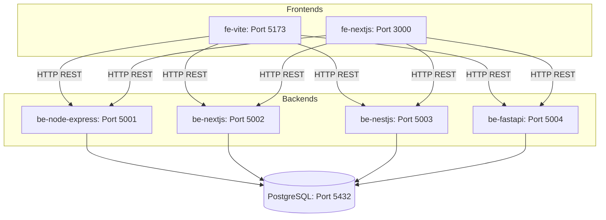

# Todo App Architecture Specification

Tài liệu thiết kế kiến trúc, luồng dữ liệu và đặc tả kỹ thuật chi tiết cho ứng dụng Todo Multi-Backend.

---

## 🏗️ Diagram Kiến trúc Tổng thể (Architecture Layout)



---

## 📂 Thư mục Dự án (Directory Structure)

```
todo-app/
├── ARCHITECTURE.md          # Tài liệu đặc tả kiến trúc chi tiết
├── docker-compose.yml       # Orchestration cho Postgres DB, 4 Backends & 2 Frontends
├── README.md                # Hướng dẫn chạy và sử dụng
├── db/
│   └── init.sql             # SQL Script tạo bảng todos
├── fe-vite/                 # React + Vite + TypeScript (Tailwind CSS)
├── fe-nextjs/               # Next.js App Router + TypeScript (Tailwind CSS)
├── be-node-express/         # Node.js + Express + TypeScript + pg pool
├── be-nextjs/               # Next.js App Router Route Handlers (API)
├── be-nestjs/               # NestJS + Dependency Injection + pg pool
└── be-fastapi/              # Python 3.9 FastAPI + Pydantic + psycopg2
```

---

## 📐 Chi tiết Các Thành phần Hệ thống

### 1. Database Layer (PostgreSQL)
- **Database Engine**: PostgreSQL 15 (Alpine)
- **Port**: `5432`
- **Database Name**: `todo_db`
- **Credentials**: `postgres` / `postgres`
- **Schema Table**:
  ```sql
  CREATE TABLE IF NOT EXISTS todos (
    id SERIAL PRIMARY KEY,
    title VARCHAR(255) NOT NULL,
    completed BOOLEAN DEFAULT FALSE NOT NULL,
    created_at TIMESTAMP DEFAULT CURRENT_TIMESTAMP NOT NULL
  );
  ```

---

## 🔌 API Interface Specifications

Tất cả 4 Backends triển khai cùng một bộ chuẩn RESTful API đồng nhất:

| Method | Endpoint | Mô tả | Request Body | Response Format |
| :--- | :--- | :--- | :--- | :--- |
| **GET** | `/api/todos` | Lấy danh sách tất cả todos (sắp xếp giảm dần theo thời gian tạo) | None | `Array<Todo>` |
| **POST** | `/api/todos` | Tạo mới một todo | `{ "title": "string" }` | `Todo` (Status 201) |
| **PATCH** | `/api/todos/:id` | Cập nhật tên hoặc trạng thái của todo | `{ "title"?: "string", "completed"?: boolean }` | `Todo` |
| **DELETE** | `/api/todos/:id` | Xóa một todo theo ID | None | `{ "message": "string", "todo": Todo }` |

---

## ⚙️ So sánh Chi tiết Các Backend Implementation

### 1. `be-node-express` (Node.js + Express + TypeScript)
- **Cổng**: `5001`
- **Mô hình**: Functional / Scripting-based HTTP server với `express`.
- **Quản lý DB**: Trực tiếp qua `pg` pool (`new Pool()`).
- **Ưu điểm**: Nhẹ nhất, ít overhead, dễ đọc, khởi động cực nhanh.

### 2. `be-nextjs` (Next.js App Router API)
- **Cổng**: `5002`
- **Mô hình**: Serverless / File-based Route Handlers (`src/app/api/todos/route.ts`).
- **Quản lý DB**: Singleton `pg` Pool với dev hot-reloading guard.
- **Ưu điểm**: Phù hợp cho mô hình Fullstack kết hợp hoặc triển khai Serverless.

### 3. `be-nestjs` (NestJS Framework)
- **Cổng**: `5003`
- **Mô hình**: Enterprise OOP Architecture (Module -> Controller -> Service).
- **Quản lý DB**: Dependency Injection với lifecycle hooks (`onModuleInit`, `onModuleDestroy`).
- **Ưu điểm**: Chuẩn hóa dự án lớn, dễ mở rộng và quản lý dependency injection.

### 4. `be-fastapi` (Python 3.9 + FastAPI)
- **Cổng**: `5004`
- **Mô hình**: Async Python REST Framework sử dụng Pydantic schemas.
- **Quản lý DB**: `psycopg2` với `RealDictCursor`.
- **Ưu điểm**: Tự động sinh Swagger API docs (`/docs`), cú pháp ngắn gọn, tích hợp tốt với AI/Data science.

---

## 🎨 So sánh Frontends

### 1. `fe-vite` (Vite + React SPA)
- **Cổng**: `5173`
- **Đặc điểm**: Client-side Rendering (CSR) thuần túy với Vite + React 18 + Tailwind CSS. Fast Refresh tức thì.

### 2. `fe-nextjs` (Next.js App Router Client)
- **Cổng**: `3000`
- **Đặc điểm**: Framework Full-stack React 18 với App Router (`'use client'`), Tailwind CSS, cấu hình metadata & SEO sẵn có.
