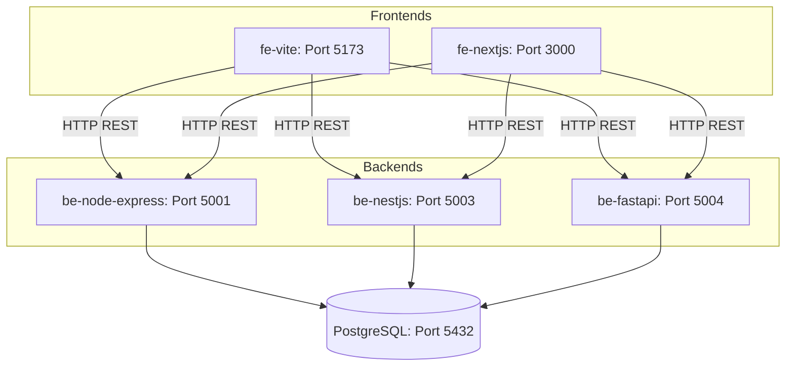

# Todo App Architecture Specification

Tài liệu thiết kế kiến trúc, luồng dữ liệu và đặc tả kỹ thuật chi tiết cho ứng dụng Todo Multi-Backend.

---

## 🏗️ Diagram Kiến trúc Tổng thể (Architecture Layout)



---

## 📂 Thư mục Dự án (Directory Structure)

```
todo-app/
├── ARCHITECTURE.md          # Tài liệu đặc tả kiến trúc chi tiết
├── docker-compose.yml       # Orchestration cho Postgres DB, 3 Backends & 2 Frontends
├── README.md                # Hướng dẫn chạy và sử dụng
├── db/
│   └── init.sql             # SQL Script tạo bảng todos
├── fe-vite/                 # React + Vite + TypeScript (Tailwind CSS)
├── fe-nextjs/               # Next.js App Router + TypeScript (Tailwind CSS)
├── be-node-express/         # Node.js + Express + TypeScript + pg pool
├── be-nestjs/               # NestJS + Dependency Injection + pg pool
└── be-fastapi/              # Python 3.9 FastAPI + Pydantic + psycopg2
```

---

## 📐 Chi tiết Các Thành phần Hệ thống

### 1. Database Layer (PostgreSQL)
- **Database Engine**: PostgreSQL 15 (Alpine)
- **Port**: `5432`
- **Database Name**: `todo_db`
- **Credentials**: `postgres` / `postgres`
- **Schema**: `users`, `categories`, `todos` (FK to both), `refresh_tokens`
  (JWT rotation), and `session` (server-side session store). Full DDL and
  indexes in [`db/init.sql`](db/init.sql).

---

## 🔌 API Interface Specifications

`be-nestjs` và `be-fastapi` vẫn triển khai bộ API đơn giản, không auth dưới đây
(và các frontend `fe-vite`/`fe-nextjs` vẫn gọi trực tiếp theo interface này):

| Method | Endpoint | Mô tả | Request Body | Response Format |
| :--- | :--- | :--- | :--- | :--- |
| **GET** | `/api/todos` | Lấy danh sách tất cả todos (sắp xếp giảm dần theo thời gian tạo) | None | `Array<Todo>` |
| **POST** | `/api/todos` | Tạo mới một todo | `{ "title": "string" }` | `Todo` (Status 201) |
| **PATCH** | `/api/todos/:id` | Cập nhật tên hoặc trạng thái của todo | `{ "title"?: "string", "completed"?: boolean }` | `Todo` |
| **DELETE** | `/api/todos/:id` | Xóa một todo theo ID | None | `{ "message": "string", "todo": Todo }` |

⚠️ **`be-node-express` đã tách khỏi interface chung này.** `/api/todos` giờ
yêu cầu JWT (`Authorization: Bearer`), có thêm `/api/session-todos` (session
cookie), `/api/auth/*`, `/api/session-auth/*`, `/api/categories`, và
`/api/todos/stats`. Nếu chọn `be-node-express` trên UI của `fe-vite`/
`fe-nextjs` mà chưa đăng nhập, các request tới `/api/todos` sẽ trả về `401`
— hai frontend này chưa có màn hình login nên chưa gọi được backend này qua
UI. Xem [`be-node-express/GUIDE.md`](be-node-express/GUIDE.md) để test qua
`curl`.

---

## ⚙️ So sánh Chi tiết Các Backend Implementation

### 1. `be-node-express` (Node.js + Express + TypeScript)
- **Cổng**: `5001`
- **Mô hình**: Layered architecture (routes → controllers → services →
  repositories), `pg` pool qua `config/db.ts`.
- **Auth**: JWT (access + rotating refresh tokens) và session-based
  (express-session + connect-pg-simple) chạy song song trên cùng bộ CRUD, để
  so sánh trực tiếp hai pattern. Chi tiết: [`be-node-express/GUIDE.md`](be-node-express/GUIDE.md).
- **Ưu điểm**: Gần nhất với một production REST API thực tế — validation
  (zod), rate limiting, ownership checks, pagination/filtering/sorting, và
  một analytical query (JOIN + GROUP BY) cho `/api/todos/stats`.

### 2. `be-nestjs` (NestJS Framework)
- **Cổng**: `5003`
- **Mô hình**: Enterprise OOP Architecture (Module -> Controller -> Service).
- **Quản lý DB**: Dependency Injection với lifecycle hooks (`onModuleInit`, `onModuleDestroy`).
- **Ưu điểm**: Chuẩn hóa dự án lớn, dễ mở rộng và quản lý dependency injection.

### 3. `be-fastapi` (Python 3.9 + FastAPI)
- **Cổng**: `5004`
- **Mô hình**: Async Python REST Framework sử dụng Pydantic schemas.
- **Quản lý DB**: `psycopg2` với `RealDictCursor`.
- **Ưu điểm**: Tự động sinh Swagger API docs (`/docs`), cú pháp ngắn gọn, tích hợp tốt với AI/Data science.

---

## 🎨 So sánh Frontends

### 1. `fe-vite` (Vite + React SPA)
- **Cổng**: `5173`
- **Đặc điểm**: Client-side Rendering (CSR) thuần túy với Vite + React 18 + Tailwind CSS. Fast Refresh tức thì.

### 2. `fe-nextjs` (Next.js App Router Client)
- **Cổng**: `3000`
- **Đặc điểm**: Framework Full-stack React 18 với App Router (`'use client'`), Tailwind CSS, cấu hình metadata & SEO sẵn có.
